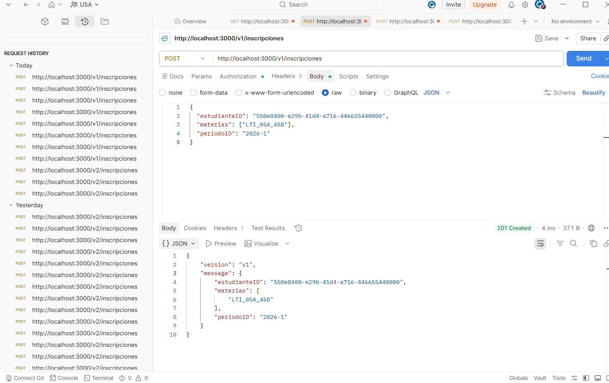
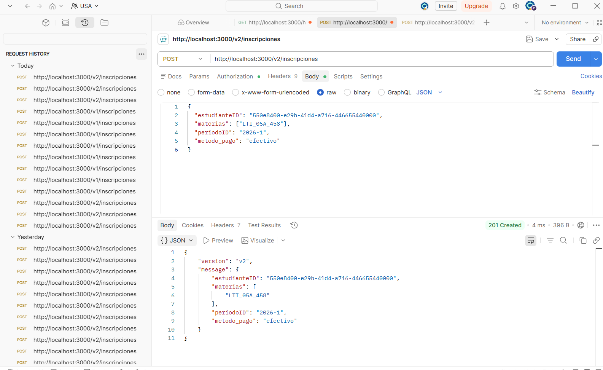
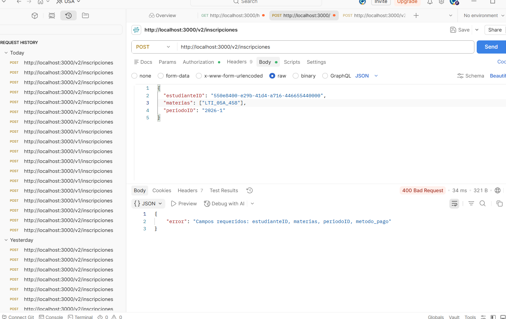
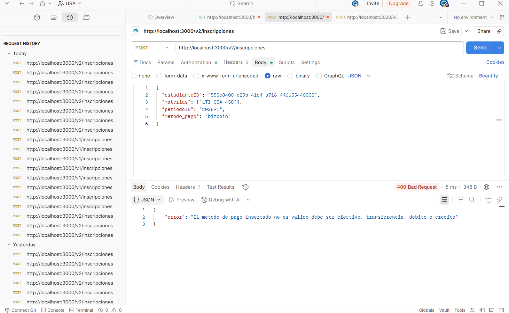
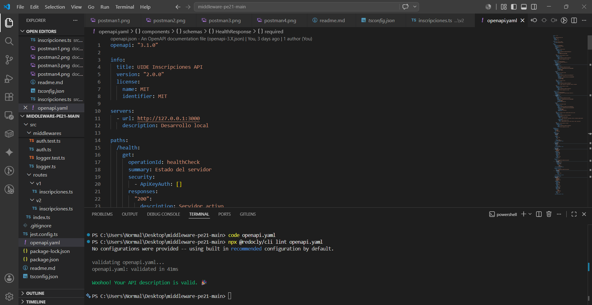
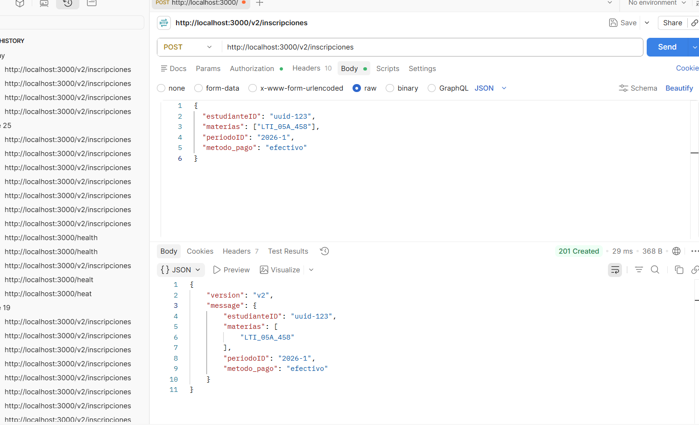
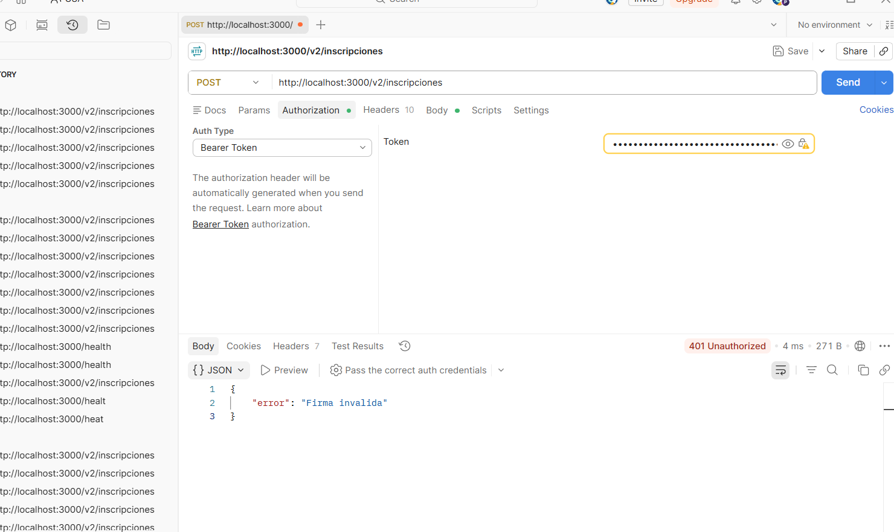
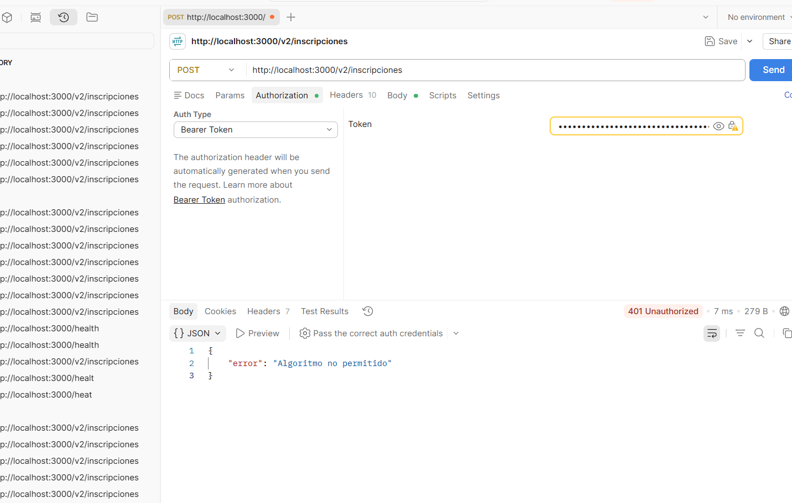

# Lo del trabajo TA-2.1  esta en la linea 100 

# PE-2.1 Configuración y primer servicio middleware
# PE-2.2 Documentación y versionado de API estan en la lnea 137


Servidor Express desarrollado con TypeScript, módulos ES y middlewares personalizados.

## Comandos de ejecución

```powershell
npm run dev
```

Salida del servidor:

```text
Servidor en puerto 3000
GET /health -> 401 (2ms)
GET /health -> 401 (1ms)
GET /noexiste -> 404 (1ms)
```

## Escenario A: Sin API key (401)

Comando:

```powershell
curl http://localhost:3000/health
```

Salida real:

```json
curl : {"error":"API key inválida o ausente"}
En línea: 1 Carácter: 1
+ curl http://localhost:3000/health
+ ~~~~~~~~~~~~~~~~~~~~~~~~~~~~~~~~~
    + CategoryInfo          : InvalidOperation: (System.Net.Htt 
   pWebRequest:HttpWebRequest) [Invoke-WebRequest], WebExcepti  
  on
    + FullyQualifiedErrorId : WebCmdletWebResponseException,Mic 
   rosoft.PowerShell.Commands.InvokeWebRequestCommand
```

Explicación:

El servidor responde con estado 401 Unauthorized porque no se envió la cabecera x-api-key requerida por el middleware de autenticación.

## Escenario B: Con API key válida (200)

Comando:

```powershell
Invoke-WebRequest -Uri "http://localhost:3000/health" -Headers @{"x-api-key"="secreto-demo"}
```

Salida:

```json
No se puede convertir el valor "x-api-key: secreto-demo" de 
tipo "System.String" al tipo "System.Collections.IDictionary".
En línea: 1 Carácter: 9
+ curl -H "x-api-key: secreto-demo" http://localhost:3000/health
+         ~~~~~~~~~~~~~~~~~~~~~~~~~
    + CategoryInfo          : InvalidArgument: (:) [Invoke-WebR 
   equest], ParameterBindingException
    + FullyQualifiedErrorId : CannotConvertArgumentNoMessage,Mi 
   crosoft.PowerShell.Commands.InvokeWebRequestCommand
 
```

Explicación:

El servidor responde con estado 200 OK porque la API key enviada coincide con la configurada en el middleware.

## Escenario C: Ruta inexistente (404)

Comando:

```powershell
Invoke-WebRequest -Uri "http://localhost:3000/noexiste" -Headers @{"x-api-key"="secreto-demo"}
```

Salida real:

```text
+ Invoke-WebRequest -Uri "http://localhost:3000/noexiste" 
-Headers @{"x ...
+ ~~~~~~~~~~~~~~~~~~~~~~~~~~~~~~~~~~~~~~~~~~~~~~~~~~~~~~~~~~~~~~
~~~~~~~
    + CategoryInfo          : InvalidOperation: (System.Net.Htt 
   pWebRequest:HttpWebRequest) [Invoke-WebRequest], WebExcepti  
  on
    + FullyQualifiedErrorId : WebCmdletWebResponseException,Mic 
   rosoft.PowerShell.Commands.InvokeWebRequestCommand
```

Explicación:

El servidor responde con estado 404 Not Found porque la ruta solicitada no existe dentro de la aplicación.


## Testing

Para ejecutar las pruebas unitarias:

```bash
npm test
```

Resultado obtenido:

```text
PASS  src/middlewares/auth.test.ts
PASS  src/middlewares/logger.test.ts

Test Suites: 2 passed, 2 total
Tests:       5 passed, 5 total
Snapshots:   0 total
Time:        0.407 s, estimated 1 s
Ran all test suites.
```

### Casos cubiertos

#### Logger Middleware

- Verifica que `next()` sea invocado al recibir una petición.
- Verifica que se registre correctamente el método y la ruta.

#### API Key Middleware

- Header `x-api-key` ausente → responde `401`.
- API key incorrecta → responde `401`.
- API key válida → invoca `next()` sin generar respuesta.

## Pruebas de los endpoints

Servidor ejecutándose en:

```text
http://localhost:3000
```
PE-2.2 Documentación y versionado de API
### Escenario 1 — POST /v1/inscripciones con campos válidos (201)



### Escenario 2 — POST /v2/inscripciones con método de pago válido (201)



### Escenario 3 — POST /v2/inscripciones sin metodo_pago (400)



### Escenario 4 — POST /v2/inscripciones con metodo_pago inválido (400)



## Validación OpenAPI

Resultado de `npx @redocly/cli lint openapi.yaml`:



## Reflexión: si otro equipo consumiera esta API

Si un equipo externo empezara a integrar esta API mañana, el primer cambio que haría al contrato OpenAPI sería agregar un schema reutilizable para las respuestas de error de todos los endpoints. Aunque actualmente se documentan errores como 400 y 401, definir un formato estándar permitiría que los consumidores sepan exactamente qué campos recibirán cuando ocurra un problema. Esto reduciría la incertidumbre al integrar la API, evitaría pruebas manuales innecesarias y haría más claro el comportamiento de `/health`, `/v1/inscripciones` y `/v2/inscripciones`.
# PE-2.3 Seguridad JWT

## Descripción

En esta práctica se implementó una capa de seguridad basada en JSON Web Token (JWT) firmado con HMAC-SHA256 y un middleware de Rate Limiting para proteger las rutas del servicio.

Las mejoras implementadas fueron:

- Autenticación mediante JWT.
- Verificación del algoritmo HS256.
- Rechazo de ataques mediante `alg:none`.
- Verificación de la firma utilizando `crypto.timingSafeEqual()`.
- Validación de los claims `sub` y `exp`.
- Rate Limiter con una ventana de 15 minutos y máximo de 10 peticiones.
- Respuesta HTTP 429 cuando se supera el límite permitido.

---

# Generar un token de prueba

### PowerShell

```powershell
$env:JWT_SECRET="secreto-demo-pe23"
node generate-token.mjs
```

### Linux / macOS

```bash
JWT_SECRET=secreto-demo-pe23 node generate-token.mjs
```

El script genera un JWT válido con los siguientes claims:

- sub
- iss
- aud
- scope
- exp
- jti

---

# Iniciar el servidor

```powershell
$env:JWT_SECRET="secreto-demo-pe23"
npm run dev
```

---

# Probar el servicio

Endpoint:

```text
POST http://localhost:3000/v2/inscripciones
```

Header:

```text
Authorization: Bearer <TOKEN_GENERADO>
```

Body utilizado:

```json
{
  "estudianteID": "uuid-123",
  "materias": [
    "LTI_05A_458"
  ],
  "periodoID": "2026-1",
  "metodo_pago": "efectivo"
}
```

---

# Resultados esperados

| Prueba | Resultado esperado |
|---------|--------------------|
| Token válido | HTTP 201 Created |
| Firma inválida | HTTP 401 Unauthorized |
| Token con alg:none | HTTP 401 Unauthorized |
| Más de 10 peticiones | HTTP 429 Too Many Requests |

---

# Variables de entorno

Crear un archivo `.env` con:

```env
JWT_SECRET=secreto-demo-pe23
```

El archivo `.env` **no debe subirse al repositorio**.

Se incluye únicamente:

```text
.env.example
```

---

# Evidencias Postman PE-2.3

## Prueba 1 - Token válido (201 Created)



---

## Prueba 2 - Firma inválida (401 Unauthorized)



---

## Prueba 3 - Token con alg:none (401 Unauthorized)

